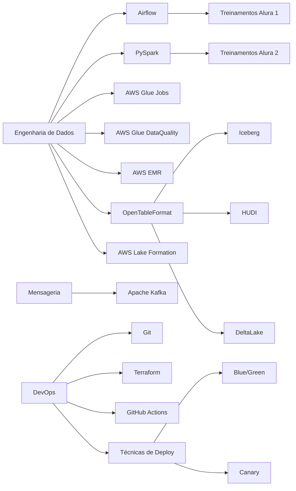

# PDI

## Objetivos de Conhecimento

- **PySpark:** Alcançar Nível 4 de proficiência
- **AWS Glue e EMR:** Atingir Nível 3 de conhecimento em ambos
- **Apache Iceberg:** Desenvolver competência de Nível 3
- **HUDI e Delta Lake:** Obter Nível 2 de compreensão em ambos formatos de tabela aberta
- **Técnicas de Deploy:** Dominar conceitos de Nível 2, incluindo Blue/Green e Canary
- **GitHub Actions:** Alcançar Nível 2 de conhecimento
- **Terraform:** Desenvolver Nível 3 de conhecimento
- **Apache Kafka:** Atingir Nível 2 de conhecimento

## Plano de Estudos

